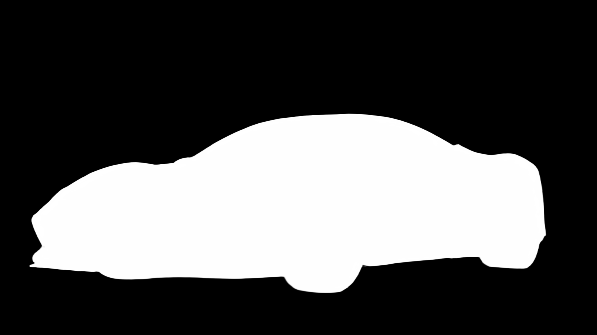
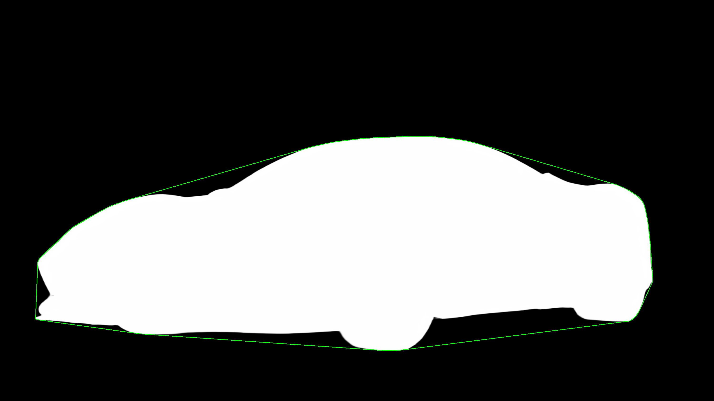
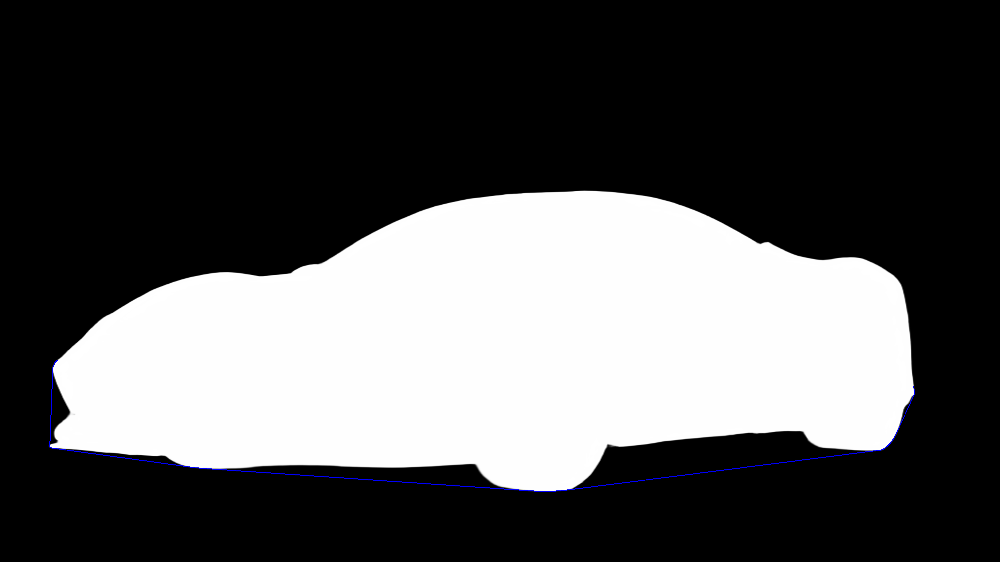
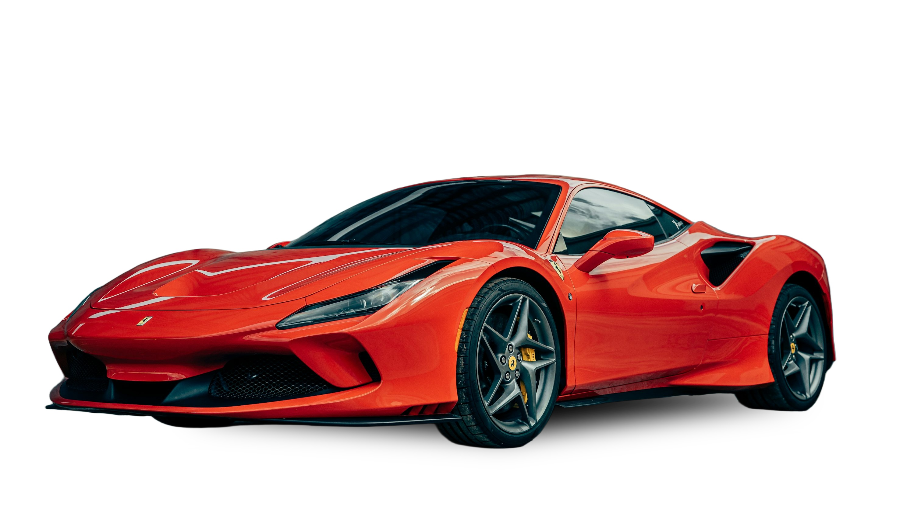

# 🚗 Car Studio

This pipeline processes images of cars to automatically remove the background and generate a **realistic, geometrically calculated shadow**.
It utilizes **BiRefNet** (state-of-the-art background removal) for segmentation and **OpenCV-based geometric reasoning** to synthesize shadows based on the car’s actual ground contact points.

---

## 🛠️ Prerequisites

* Python **3.10+** recommended
* GPU (CUDA) strongly recommended for faster inference (CPU fallback supported)

### Dependencies

```bash
pip install torch torchvision torchaudio --index-url https://download.pytorch.org/whl/cu118  # Adjust CUDA version if needed
pip install opencv-python numpy pillow transformers
pip install timm  # Required for BiRefNet backbone
```

---

## 📂 Directory Structure

```text
Project_Root/
├── pipeline.py
├── car_images/                # [INPUT] Raw car images
├── masks/                     # [OUTPUT] Binary segmentation masks
├── images_background_removed/ # [OUTPUT] Transparent car PNGs
├── 1_full_hull/               # [DEBUG] Full convex hull visualization
├── 2_center_line_vis/         # [DEBUG] Center-line used for filtering
├── 3_filtered_hull/           # [DEBUG] Hull edges below center
├── 4_longest_lines_output/    # [DEBUG] Two longest ground-contact lines
├── 5_shadow_only/             # [OUTPUT] Generated shadow
└── 6_final_composite/         # [FINAL OUTPUT] Car + realistic shadow
```

---

## ⚙️ Configuration

Adjust these parameters at the top of `pipeline.py`:

* **`USE_HALF_PRECISION`**: Enable for GPU inference to reduce memory usage
* **`DEVICE`**: Auto-detects `cuda` or `cpu`
* **`target_size`**: Default `(1024, 1024)`
  Increase to `(2048, 2048)` for higher-resolution outputs

---

## 🧠 How It Works (Pipeline Overview)

## 🔍 Pipeline Visualization

All intermediate outputs shown below are stored in the **`images/`** folder.

---

### **0️⃣ Original Input Image**

Raw car image provided to the pipeline.


---

### **1️⃣ Mask**

Precise foreground mask generated by BiRefNet.



---

### **1️⃣ Background Removed Image**

The binary mask is applied to the original image to produce a transparent RGBA cut-out.


---

### **3️⃣ Convex Hull**

Outer boundary of the car mask, used for geometric analysis.



---

### **4️⃣ Filtered Convex Hull**

Hull edges filtered to retain only those **below the vertical center**, eliminating roof and side edges.



---

### **5️⃣ Two Longest Ground-Contact Lines**

The two longest bottom-most hull edges, typically representing tire contact points.


---

### **6️⃣ Shadow Shifted**

Projected shadow shape shifted downward by **5% of object height** to ensure realistic grounding.


---

### **7️⃣ Final Composite Image**

Final studio-quality output with the car composited over a soft, realistic shadow.  
*A white background is added here for visualization purposes; the actual final output is transparent.*




---

## 🧮 Shadow Generation Logic (Key Ideas)

* **Convex Hull Analysis** for robust boundary detection
* **Geometric Line Filtering** to identify ground contact regions
* **Parallelogram Projection** to infer shadow shape
* **Adaptive Blur (via area of parallelogram)** for natural softness
* **Vertical Offset Correction** to avoid floating shadows

---

## 🏃 Usage

Run the full pipeline with:

```bash
python pipeline.py
```

All intermediate and final outputs will be automatically generated.


